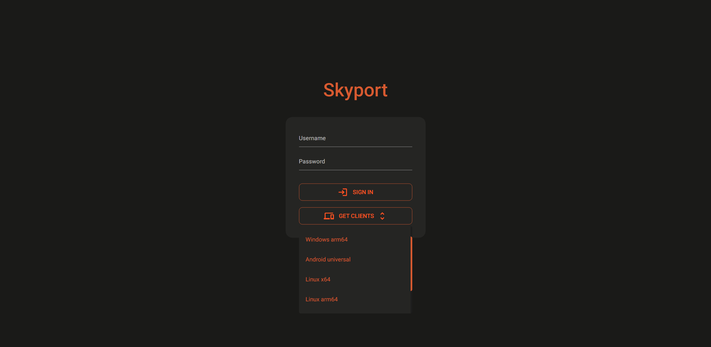
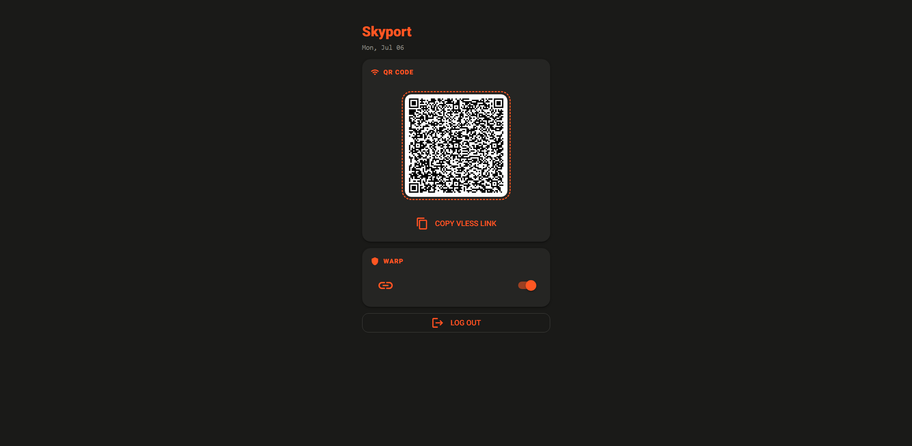

# Skyport
A self-hosted, censorship-resistant proxy panel built on Xray-core with Cloudflare CDN fronting and WARP egress. Designed to resist passive traffic analysis, active probing, and ML-based classification.

## Features
- VLESS+XHTTP tunneled through Cloudflare CDN
- Cloudflare WARP as outbound egress (toggleable)
- Automatic TLS via Caddy + Cloudflare DNS
- Web UI with QR code and VLESS link generation
- facade for probes
- Single container deployment


## Screenshots
### Login page

### Dashboard page


## Requirements
- A domain managed by Cloudflare
- A Cloudflare auth token with `Zone.DNS Edit` and `Zone.Zone Read` permissions
- Docker and Docker Compose
- A VPS with `NET_ADMIN` capability (required for WARP/TUN)

## Notes
All values (e.g. `XRAY_UUID`, `XRAY_PATH`, `FRONTEND_PATH`, `XRAY_DECRYPTION_KEY`, `XRAY_ENCRYPTION_KEY`) are only generated **once** on first startup and persisted.

Skyport checks whether config files already exist on startup. If they do, it simply starts without regenerating or updating anything. This means that updates to Skyport (e.g. new Caddy templates or Xray config templates) will **not** be applied to an existing installation automatically.

This is intentional. In a censorship circumvention context, a working setup is critical, since forcibly applying updates could break an already-functioning connection, potentially without warning. Existing installations are left untouched so that they keep working exactly as they are, even across Skyport updates.

If you want to pull in new changes, you need to do a fresh installation, see below. Note that a fresh installation will generate brand new values for `XRAY_UUID`, `XRAY_PATH`, `FRONTEND_PATH`, `XRAY_DECRYPTION_KEY`, and `XRAY_ENCRYPTION_KEY`, so the previous values will no longer be valid, and any existing client configs will need to be updated. If any of these values are set manually via environment variables, they will remain unchanged across a reinstall.

## Reinstall
If you want to to reinstall skyport, run the following command in full (make sure to paste and run the entire block, not just parts of it):

```bash
read -p "This will delete existing config directories. Continue? (y/N) " confirm && \
[[ "$confirm" == [yY] ]] && \
cd skyport && \
docker compose down && \
rm -rf ./config/caddy_config ./config/xray_config && \
mkdir -p ./config/caddy_config ./config/xray_config/{xray_core,db} && \
docker compose up -d
```

## Installation
### 1. Create directory structure
```bash
mkdir skyport && \
cd skyport && \
mkdir -p config/{certs,caddy_config,xray_config/xray_core,xray_config/db} && \
touch docker-compose.yaml && \
touch .env
```

### 2. Create `docker-compose.yml`
There are two available images — pick one:

| Image | Description |
|---|---|
| `xia1997x/skyport:latest` | Full version with web UI. Requires `SKYPORT_USERNAME` and `SKYPORT_PASSWORD`. |
| `xia1997x/skyport-headless:latest` | No web UI. `SKYPORT_USERNAME` and `SKYPORT_PASSWORD` are not needed. |

**With web UI:**

```yaml
services:
  skyport:
    image: xia1997x/skyport:latest
    container_name: skyport
    restart: always
    env_file:
      - .env
    ports:
      - '$PORT:443'
    cap_add:
      - NET_ADMIN
    devices:
      - /dev/net/tun:/dev/net/tun
    volumes:
      - ./config/certs:/xray_base/caddy_certs
      - ./config/caddy_config:/xray_base/backend/caddy_config
      - ./config/xray_config:/xray_base/backend/xray_config/
      - ./config/xray_config/db:/xray_base/backend/xray_config/db
      - ./config/xray_config/xray_core:/xray_base/backend/xray_config/xray_core
```

**Headless (no web UI):**

```yaml
services:
  skyport:
    image: xia1997x/skyport-headless:latest
    container_name: skyport
    restart: always
    env_file:
      - .env
    ports:
      - '$PORT:443'
    cap_add:
      - NET_ADMIN
    devices:
      - /dev/net/tun:/dev/net/tun
    volumes:
      - ./config/certs:/xray_base/caddy_certs
      - ./config/caddy_config:/xray_base/backend/caddy_config
      - ./config/xray_config:/xray_base/backend/xray_config/
      - ./config/xray_config/db:/xray_base/backend/xray_config/db
      - ./config/xray_config/xray_core:/xray_base/backend/xray_config/xray_core
```

### 3. Create `.env`
```env
DOMAIN_NAME=
CLOUDFLARE_AUTH_TOKEN=cloudflare_token
PORT=443
ENABLE_CADDY_LOG=False
ENABLE_WARP_ON_STARTUP=True
SKYPORT_USERNAME=change-me
SKYPORT_PASSWORD=change-me
XRAY_VERSION=26.3.27 # latest xray version at the time of writing
# FRONTEND_PATH=
# XRAY_DECRYPTION_KEY=
# XRAY_ENCRYPTION_KEY=
# XRAY_UUID=
# XRAY_PATH=
```

| Variable | Description |
|---|---|
| `DOMAIN_NAME` | Your domain managed by Cloudflare. Must be a subdomain in the format `subdomain.example.com` |
| `CLOUDFLARE_AUTH_TOKEN` | Cloudflare auth token with `Zone.DNS Edit` and `Zone.Zone Read` permissions |
| `PORT` | Host port to expose (maps to container port 443, which is fixed and cannot be changed). Used both by Docker for the port mapping and by skyport itself to generate the correct external port in the VLESS link and QR code |
| `ENABLE_CADDY_LOG` | Enable Caddy access logs (`True`/`False`) |
| `ENABLE_WARP_ON_STARTUP` | Connect to WARP automatically on startup (`True`/`False`). If enabled and the WARP registration fails, skyport will exit instead of continuing without WARP. |
| `SKYPORT_USERNAME` | Web UI login username |
| `SKYPORT_PASSWORD` | Web UI login password |
| `FRONTEND_PATH` | ⚠️ Optional, for testing only. Overrides the auto-generated frontend path. Must be lowercase and contain only letters, numbers, and `-`. If unset, a random path is generated. |
| `XRAY_VERSION` | Xray-core version to use. Either `latest` or a specific version tag, e.g. `26.3.27`. In production, it's recommended to pin a specific version rather than using `latest` |
| `XRAY_DECRYPTION_KEY` | ⚠️ Optional, for testing only. Overrides the auto-generated server-side decryption key for Xray's VLESS encryption feature. If unset, a key is generated automatically. |
| `XRAY_ENCRYPTION_KEY` | ⚠️ Optional, for testing only. Overrides the auto-generated client-side encryption key for Xray's VLESS encryption feature. If unset, a key is generated automatically. |
| `XRAY_UUID` | ⚠️ Optional, for testing only. Overrides the auto-generated Xray UUID. If unset, a UUID is generated automatically. |
| `XRAY_PATH` | ⚠️ Optional, for testing only. Overrides the auto-generated Xray path. Must be lowercase and contain only letters, numbers, and `-`. If unset, a random path is generated. |


### 4. Start
```bash
docker compose up -d
```

Caddy will automatically obtain a TLS certificate via Cloudflare DNS challenge on first startup. Once the container is running, fetch your dashboard URL and VLESS link from the logs:

```bash
docker compose logs skyport | grep -E "DASHBOARD URL|https|VLESS CONNECTION LINK|vless"
```

## Cloudflare Setup
1. Your domain must use Cloudflare as its DNS provider
2. Create an API token with `Zone.DNS Edit` and `Zone.Zone Read` permissions scoped to your domain
3. Skyport will automatically set your domain's proxy status to **Proxied** (orange cloud) — this is what enables CDN fronting

> **Note:** You can manually disable proxying in Cloudflare, but it will reset to **Proxied** the next time Skyport is restarted. Persisting a manual override may be supported in the future.

## Updating
```bash
docker compose pull
docker compose up -d
```